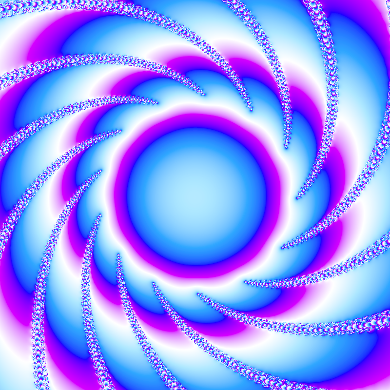
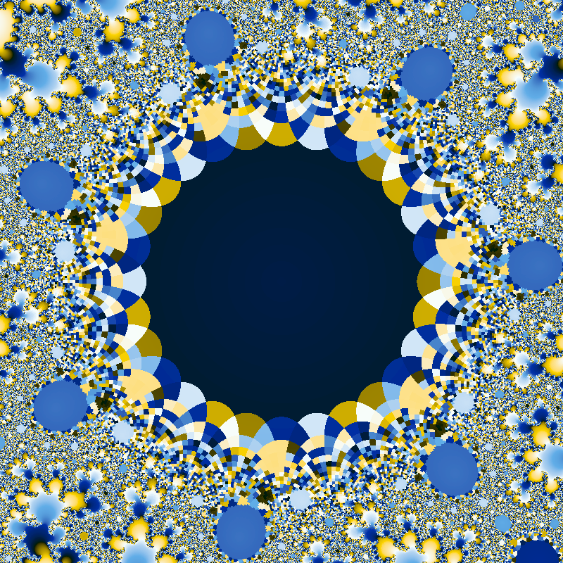

# Julia

WGPU compute shader implementation for quadratic polynomial [Julia set](https://en.wikipedia.org/wiki/Julia_set) rendering.

## Floating point precision

Shader currently computes the iteration process using statically sized 32-bit floating numbers, which creates certain limitations for higher order polynomials and zoom range.  

## Controls

* Arrows keys to modify the constant
* Scroll wheel to zoom
* Left click to center on cursor
